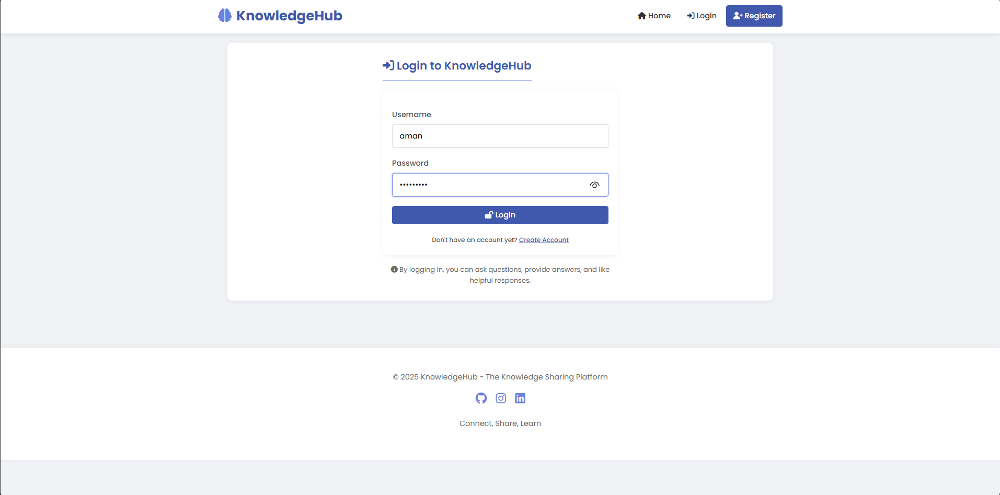

# KnowledgeHub

A professional Q&A platform built with Django that allows users to ask questions, provide answers, and like helpful content.

## Features

- **User Authentication**
  - Register with username, email, and password
  - Secure login and logout
  - User-specific actions and content

- **Question Management**
  - Create detailed questions with title and content
  - View questions from all users
  - Organized question listing with user and date information

- **Answer System**
  - Post answers to any question
  - View all answers for a specific question
  - Like/unlike answers from other users

- **Modern UI**
  - Responsive design works on all devices
  - Clean, professional interface with card-based layout
  - Intuitive navigation and clear visual hierarchy

## Technology Stack

- **Backend**: Django 5.2
- **Frontend**: HTML, CSS (with modern design principles)
- **Database**: SQLite (development)
- **Icons**: Font Awesome
- **Fonts**: Poppins (Google Fonts)

## Installation

1. Clone the repository
   ```
   git clone https://github.com/amanuchitkar/Assignment_TransportSimple.git
   cd knowledge-hub
   ```

2. Create and activate virtual environment
   ```
   python -m venv venv
   source venv/bin/activate  # On Windows: venv\Scripts\activate
   ```

3. Install dependencies
   ```
   pip install -r requirements.txt
   ```

4. Run migrations
   ```
   python manage.py migrate
   ```

5. Create superuser (admin)
   ```
   python manage.py createsuperuser
   ```

6. Run the development server
   ```
   python manage.py runserver
   ```

7. Access the application at `http://127.0.0.1:8000/`

## Project Structure

```
Assignment_TransportSimple/
├── qanda/               # Main app for Q&A functionality
├── quora_clone/         # Project settings
├── templates/           # HTML templates
│   └── qanda/           # App-specific templates
├── static/              # Static files (CSS, JS, images)
├── media/               # User uploaded content
├── venv/                # Virtual environment
├── manage.py            # Django management script
├── requirements.txt     # Project dependencies
└── README.md            # Project documentation
```

## Usage

1. Register a new account or login with existing credentials
2. Browse questions on the home page
3. Click on a question to view details and answers
4. Post your own questions using the "Ask Question" button
5. Answer questions and like helpful responses
6. Use the admin interface (`/admin`) to manage content

## Screenshots


*The main page displays all questions.*


*Detailed view of a question with answers.*

  
*View and interact with answers for a specific question.*

  
*User login interface is used to access the platform.*


## Acknowledgments

- Developed by [Aman Uchitkar](https://github.com/amanuchitkar)
<<<<<<< HEAD
=======
- Created as a learning project to demonstrate Django capabilities 
>>>>>>> d43eda112a1631b0062b3e4602bf40c3e9cd40f4
